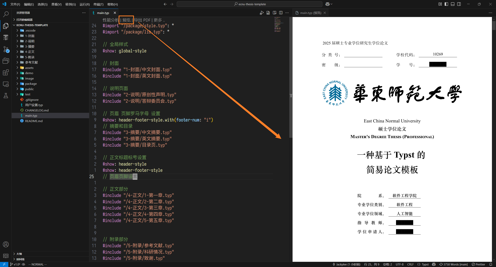

# 一个简单的中文论文 Typst 模板

项目地址：[JackyLee3362/simple-typst-thesis-template](https://github.com/JackyLee3362/simple-typst-thesis-template)

## 项目介绍

本项目基于 [modern-ecnu-thesis – Typst Universe](https://typst.app/universe/package/modern-ecnu-thesis/) 模板，
经过本人的重构优化，
适合**边写论文边学习** Typst 语法，
并且可以定制自己的样式。

## 快速开始

```sh
git clone https://github.com/JackyLee3362/simple-typst-thesis-template.git
code simple-typst-thesis-template
```

在 `vscode` 中搜索插件 `Tinymist Typst`

，

安装并下载后，
在 `vscode` 中打开 `main.typ`，
并点击 `预览`，
如下所示



即可开始编写论文！

## 如何配置？

在项目中选择 `用户配置.typ` 文件，
修改其中的变量，
即可实时预览变化。

## 关于字体

本项目需要的字体在 `package/font.typ` 中配置，
建议下载

- 新罗马字体：`Times New Roman`，用于所有英文字体
- 方正宋体: `FZShuSong-Z01S`，用于正文
- 华文宋体: `Heiti SC`，用于标题
- 方正楷体`FZKai-Z03S`，用于中文斜体
- 阿里巴巴普惠体: `Alibaba PuHuiTi 2.0`，用于中文加粗
- 等宽字体 JetBrains Mono: `JetBrains Mono`，用于代码块

## 项目的结构

```sh
Project
│   main.typ           主文件
│   用户设置.typ       用户配置文件
│
├───1-封面
│       mod.typ        封面样式
│       中文封面.typ
│       英文封面.typ
│
├───2-说明
│       mod.typ        说明文件样式
│       原创性声明.typ
│       答辩委员会.typ
│
├───3-摘要
│       mod.typ        摘要样式
│       中文摘要.typ
│       目录页.typ
│       英文摘要.typ
│
├───4-正文
│       1-第一章.typ
│       2-第二章.typ
│       3-第三章.typ
│       4-第四章.typ
│       5-第五章.typ
│       mod.typ        正文样式
│
├───5-附录
│       mod.typ
│       参考文献.typ
│       科研情况.typ
│       致谢.typ       附录样式
│
├───demo               示例文件夹，可以单独预览
├───image              存放论文图片的文件夹
├───package
│       font.typ       字体配置文件
│       lib.typ        导入三方库的文件
│       style.typ      全局样式文件夹
│       util.typ       全局工具类
│
├───public             存放校徽等公共资源文件
│
└───参考文献           放置 bib 参考文献的文件夹

```

## 为什么会有该项目？

Typst 作为一款排版工具，
网上的中文教程依然较少，
对于即将毕业的学生来说，
很难花费大量的时间和精力研究其中的语法，
即使存在相关论文模板，
也很难进行自定义的定制。

## FAQ

## 感谢

- [The Raindrop-Blue Book (Typst 中文教程)](https://typst-doc-cn.github.io/tutorial/)
- [Typst 中文社区导航](https://typst-doc-cn.github.io/guide/)
- [nju-lug/modern-nju-thesis: 南京大学学位论文 Typst 模板 modern-nju-thesis](https://github.com/nju-lug/modern-nju-thesis)
